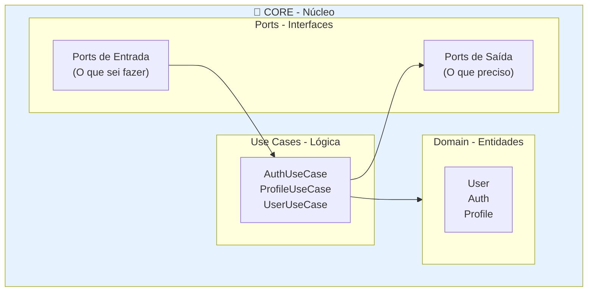
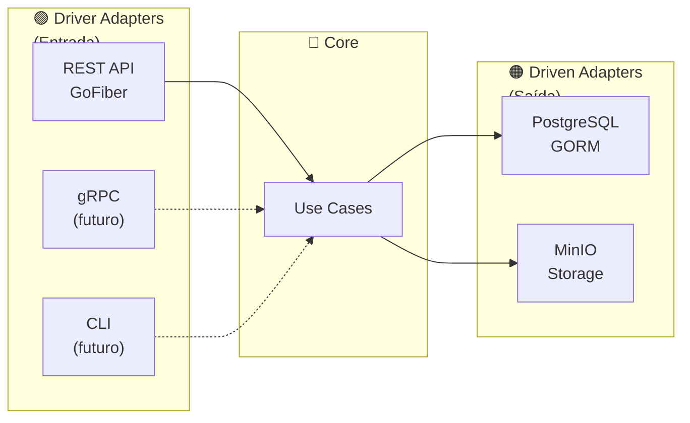

# 📘 Guia de Arquitetura do Projeto

> **Explicação didática da Arquitetura Hexagonal (Ports & Adapters) implementada neste projeto**

---

## 📋 Índice

1. [O que é Arquitetura Hexagonal?](#o-que-é-arquitetura-hexagonal)
2. [Por que usar essa arquitetura?](#por-que-usar-essa-arquitetura)
3. [Estrutura do Projeto](#estrutura-do-projeto)
4. [As Camadas Explicadas](#as-camadas-explicadas)
5. [Padrões e Boas Práticas Implementadas](#padrões-e-boas-práticas-implementadas)
6. [Fluxo de uma Requisição](#fluxo-de-uma-requisição)
7. [Como Adicionar Novas Funcionalidades](#como-adicionar-novas-funcionalidades)
8. [Glossário](#glossário)

---

## 🎯 O que é Arquitetura Hexagonal?

Imagine uma **cebola** 🧅 - com várias camadas, onde o **centro** é o mais importante e protegido.

```
                    ┌─────────────────────────────────────┐
                    │         MUNDO EXTERNO               │
                    │  (usuários, banco de dados, APIs)   │
                    │                                     │
                    │    ┌───────────────────────────┐    │
                    │    │      ADAPTERS             │    │
                    │    │   (tradutores)            │    │
                    │    │                           │    │
                    │    │    ┌─────────────────┐    │    │
                    │    │    │     CORE        │    │    │
                    │    │    │                 │    │    │
                    │    │    │  ❤️ Regras de   │    │    │
                    │    │    │    Negócio     │    │    │
                    │    │    │                 │    │    │
                    │    │    └─────────────────┘    │    │
                    │    │                           │    │
                    │    └───────────────────────────┘    │
                    │                                     │
                    └─────────────────────────────────────┘
```

### A Metáfora do Restaurante 🍽️

Pense em um restaurante:

| Elemento do Restaurante | Elemento na Arquitetura |
|------------------------|------------------------|
| **Chef de cozinha** | **Core** (regras de negócio) |
| **Garçons** | **Adapters de entrada** (recebem pedidos) |
| **Cardápio** | **Ports de entrada** (interface do que pode ser pedido) |
| **Lista de compras** | **Ports de saída** (o que o chef precisa) |
| **Fornecedores** | **Adapters de saída** (entregam ingredientes) |
| **Gerente do restaurante** | **Application Layer** (orquestra tudo) |
| **Formulário de fornecedores** | **DI Container** (conecta fornecedores ao restaurante) |

O **chef** não precisa saber:
- Como o pedido chegou (app, telefone, presencial)
- De onde vêm os ingredientes (mercado A ou B)

Ele só precisa saber **cozinhar** (regras de negócio).

---

## 🤔 Por que usar essa arquitetura?

### Problemas do código "normal" (sem arquitetura)

```
❌ CÓDIGO ACOPLADO

┌─────────────────────────────────────────────────────┐
│                                                     │
│   Handler HTTP ───┬──── Banco de Dados             │
│        │          │          │                      │
│        └──────────┼──────────┘                      │
│                   │                                 │
│            Tudo misturado!                          │
│                                                     │
└─────────────────────────────────────────────────────┘

Problemas:
• Trocar o banco de dados? Precisa mudar TUDO
• Adicionar uma CLI? Duplicar código
• Testar? Precisa do banco rodando
```

### Benefícios da Arquitetura Hexagonal

```
✅ CÓDIGO DESACOPLADO

                    ┌─────────┐
                    │   CLI   │
                    └────┬────┘
                         │
┌─────────┐         ┌────▼────┐         ┌──────────┐
│  REST   │────────►│  CORE   │◄────────│ PostgreSQL│
└─────────┘         └────▲────┘         └──────────┘
                         │
                    ┌────┴────┐
                    │  gRPC   │
                    └─────────┘

Benefícios:
• Trocar o banco? Só muda o adapter
• Adicionar CLI? Reutiliza o core
• Testar? Usa mocks, sem banco real
```

---

## 📁 Estrutura do Projeto

```
new_api/
│
├── 📂 cmd/                              # ← INÍCIO DA APLICAÇÃO
│   └── backend/
│       └── main.go                      # Ponto de entrada, monta tudo
│
├── 📂 internal/                         # ← CÓDIGO INTERNO DA APLICAÇÃO
│   │
│   ├── 📂 app/                          # 🟣 APPLICATION LAYER (NOVO!)
│   │   └── application.go               # Unifica todos os use cases
│   │
│   ├── 📂 di/                           # 🟣 INJEÇÃO DE DEPENDÊNCIAS (NOVO!)
│   │   └── container.go                 # Cria e conecta tudo
│   │
│   ├── 📂 core/                         # 🔵 NÚCLEO (O Chef!)
│   │   │
│   │   ├── 📂 domain/                   # O que a aplicação SABE
│   │   │   ├── entity/                  # Objetos do negócio
│   │   │   │   ├── user.go
│   │   │   │   ├── auth.go
│   │   │   │   └── profile.go
│   │   │   └── errors/                  # Erros de negócio
│   │   │
│   │   ├── 📂 port/                     # O que a aplicação PRECISA
│   │   │   ├── input/                   # Contratos de entrada
│   │   │   │   ├── auth_usecase.go
│   │   │   │   ├── profile_usecase.go
│   │   │   │   └── user_usecase.go
│   │   │   └── output/                  # Contratos de saída
│   │   │       ├── profile_repository.go
│   │   │       └── user_repository.go
│   │   │
│   │   ├── 📂 usecase/                  # O que a aplicação FAZ
│   │   │   ├── auth/
│   │   │   ├── profile/
│   │   │   └── user/
│   │   │
│   │   └── 📂 dto/                      # Contratos de dados (COM VALIDAÇÃO!)
│   │       ├── input.go                 # Dados de entrada + Validate()
│   │       ├── output.go
│   │       └── filter.go
│   │
│   ├── 📂 adapter/                      # 🟢 ADAPTERS (Os tradutores!)
│   │   │
│   │   ├── 📂 driver/                   # ENTRADA (Garçons)
│   │   │   └── rest/
│   │   │       ├── server.go
│   │   │       ├── handler/             # Recebem as requisições
│   │   │       │   └── health_handler.go  # Health check robusto
│   │   │       └── middleware/
│   │   │
│   │   └── 📂 driven/                   # SAÍDA (Fornecedores)
│   │       ├── persistence/
│   │       │   └── postgres/
│   │       │       ├── model/
│   │       │       ├── mapper/          # Com MapSlice genérico
│   │       │       └── repository/
│   │       └── storage/
│   │           └── minio/
│   │
│   └── 📂 config/                       # Configurações tipadas
│
├── 📂 pkg/                              # Pacotes reutilizáveis
│   ├── apperror/                        # 🆕 ERROS CENTRALIZADOS
│   │   └── error.go                     # Erros tipados com códigos
│   ├── context/                         # 🆕 CONTEXT PROPAGATION
│   │   └── context.go                   # Logger e user info via context
│   ├── logger/                          # Sistema de logs (slog)
│   │   ├── logger.go
│   │   ├── middleware.go
│   │   └── elasticsearch.go
│   ├── pgerror/
│   └── validator/
│
├── 📂 configs/
│   ├── locales/
│   └── .env
│
└── 📂 build/
    └── docker/
```

---

## 🧩 As Camadas Explicadas

### 1️⃣ CORE - O Coração da Aplicação



#### 📦 Entities (Entidades)

São os "objetos do mundo real" da sua aplicação:

```go
// internal/core/domain/entity/user.go

type User struct {
    ID        uint
    Name      string      // Nome do usuário
    Username  string      // Login
    Email     string      // Email
    Auth      *Auth       // Dados de autenticação
}

// Métodos de negócio
func (u *User) IsActive() bool {
    return u.Auth != nil && u.Auth.Status
}
```

> 💡 **Entidades são PURAS** - não sabem nada sobre banco de dados ou HTTP

#### 🔌 Ports (Portas)

São **contratos** (interfaces) que definem:
- O que a aplicação **sabe fazer** (entrada)
- O que a aplicação **precisa** (saída)

```go
// Port de ENTRADA - O que sei fazer
type UserUseCase interface {
    CreateUser(ctx, input) (*UserOutput, error)
    GetUsers(ctx, filter) (*PaginatedOutput, error)
    DeleteUsers(ctx, ids) error
}

// Port de SAÍDA - O que preciso
type UserRepository interface {
    Create(ctx, user) error
    FindAll(ctx, filter) ([]*User, error)
    Delete(ctx, ids) error
}
```

#### ⚙️ Use Cases (Casos de Uso)

É onde mora a **lógica de negócio**:

```go
// internal/core/usecase/user/user_usecase.go

func (uc *userUseCase) CreateUser(ctx, input) (*UserOutput, error) {
    // 1. Validar entrada (NOVO! DTOs têm validação)
    if err := input.Validate(); err != nil {
        return nil, err  // Retorna erro tipado
    }
    
    // 2. Criar entidade
    user := entity.NewUser(input.Name, input.Email, ...)
    
    // 3. Salvar (via port de saída)
    if err := uc.userRepo.Create(ctx, user); err != nil {
        return nil, err
    }
    
    // 4. Retornar resultado
    return toUserOutput(user), nil
}
```

---

### 2️⃣ ADAPTERS - Os Tradutores



---

## 🆕 Padrões e Boas Práticas Implementadas

### 1️⃣ Container de Injeção de Dependências (DI Container)

**O que é?** Uma "fábrica" que cria todas as peças da aplicação e as conecta.

**Por que usar?** 
- Centraliza a criação de objetos
- Facilita testes (pode trocar peças por mocks)
- Evita código duplicado no main.go

```go
// internal/di/container.go

// O Container é como um "montador de Lego"
// Ele sabe como criar e conectar todas as peças
type Container struct {
    Config *config.Config        // Configurações
    Log    *logger.Logger        // Sistema de logs
    DB     *gorm.DB              // Conexão com banco
    
    repositories *app.Repositories  // Acesso ao banco
    useCases     *useCases          // Lógica de negócio
}

// NewContainer cria tudo de uma vez
func NewContainer(cfg *config.Config, log *logger.Logger, db *gorm.DB) *Container {
    c := &Container{Config: cfg, Log: log, DB: db}
    
    // Primeiro cria os repositories (acesso ao banco)
    c.initRepositories()
    
    // Depois cria os use cases (que precisam dos repositories)
    c.initUseCases()
    
    return c
}

// Application retorna tudo pronto para usar
func (c *Container) Application() *app.Application {
    return app.New(c.Config, c.Log, c.useCases.Auth, ...)
}
```

**Como era antes (❌ Ruim):**
```go
// main.go - MUITO código, difícil de manter
func main() {
    userRepo := repository.NewUserRepository(db)
    profileRepo := repository.NewProfileRepository(db)
    authUC := auth.NewAuthUseCase(userRepo, authConfig)
    profileUC := profile.NewProfileUseCase(profileRepo)
    userUC := user.NewUserUseCase(userRepo)
    // ... muito mais código ...
}
```

**Como é agora (✅ Simples):**
```go
// main.go - LIMPO e fácil de entender
func main() {
    cfg := config.MustLoad()
    log := initLogger(cfg)
    db := postgres.MustConnect(...)
    
    // Uma linha cria TUDO!
    container := di.NewContainer(cfg, log, db)
    application := container.Application()
    
    server := rest.NewServer(config, application, log)
    server.Start()
}
```

---

### 2️⃣ Application Layer

**O que é?** Uma "sacola" que carrega todos os use cases juntos.

**Por que usar?** 
- Facilita adicionar novas interfaces (REST, gRPC, CLI)
- Cada interface recebe a mesma "sacola" de funcionalidades

```go
// internal/app/application.go

// Application é a "sacola" com tudo que a aplicação sabe fazer
type Application struct {
    Config  *config.Config
    Log     *logger.Logger
    
    // Todas as funcionalidades (use cases)
    Auth    input.AuthUseCase      // Login, logout, etc.
    Profile input.ProfileUseCase   // Criar, editar perfis
    User    input.UserUseCase      // Criar, editar usuários
    
    // Acesso aos dados
    Repositories *Repositories
}

// Se quiser criar uma CLI, é super fácil:
func main() {
    app := container.Application()
    
    // CLI usa os MESMOS use cases do REST!
    result, err := app.User.CreateUser(ctx, input)
}
```

---

### 3️⃣ Erros Centralizados (AppError)

**O que é?** Um sistema de erros com "tipos" que podem ser entendidos por qualquer interface.

**Por que usar?**
- O mesmo erro funciona em REST (HTTP 404), gRPC (NotFound), CLI (mensagem)
- Cada erro tem um código único ("USER_NOT_FOUND")
- Facilita debugging e logs

```go
// pkg/apperror/error.go

// Códigos de erro (podem ser usados em qualquer lugar)
const (
    CodeNotFound         Code = "NOT_FOUND"
    CodeInvalidInput     Code = "INVALID_INPUT"
    CodeUnauthorized     Code = "UNAUTHORIZED"
)

// Erro com informações ricas
type Error struct {
    Code    Code   // "USER_NOT_FOUND"
    Message string // "usuário não encontrado"
    Field   string // "email" (qual campo deu erro)
    Cause   error  // erro original
}

// Funções helper para criar erros facilmente
apperror.NotFound("user")              // → [NOT_FOUND] user not found
apperror.InvalidInput("email", "...")  // → [INVALID_INPUT] email: ...
apperror.Unauthorized("token expired") // → [UNAUTHORIZED] token expired
```

**Exemplo de uso:**
```go
// No Use Case
func (uc *userUseCase) GetUser(id uint) (*User, error) {
    user, err := uc.repo.FindByID(id)
    if err != nil {
        return nil, apperror.NotFound("user")  // ← Erro tipado
    }
    return user, nil
}

// No Handler REST
func (h *Handler) getUser(c *fiber.Ctx) error {
    user, err := h.useCase.GetUser(id)
    if err != nil {
        // O ErrorHandler sabe traduzir automaticamente:
        // CodeNotFound → HTTP 404
        // CodeInvalidInput → HTTP 400
        return h.handleError(c, err)
    }
}
```

---

### 4️⃣ Validação em DTOs

**O que é?** Cada DTO (objeto de entrada) tem um método `Validate()` que verifica se os dados estão corretos.

**Por que usar?**
- Valida ANTES de processar
- Mensagens de erro claras
- Reutilizável em qualquer interface

```go
// internal/core/dto/input.go

type UserInput struct {
    Name      *string `json:"name"`
    Email     *string `json:"email"`
    ProfileID *uint   `json:"profile_id"`
}

// Validate verifica se os dados estão OK
func (u *UserInput) Validate() error {
    // Nome precisa ter pelo menos 5 caracteres
    if u.Name != nil && len(*u.Name) < 5 {
        return apperror.InvalidInput("name", "nome precisa ter 5+ caracteres")
    }
    
    // Email precisa ser válido
    if u.Email != nil && !isValidEmail(*u.Email) {
        return apperror.InvalidInput("email", "email inválido")
    }
    
    return nil  // Tudo OK!
}

// Uso no Use Case:
func (uc *userUseCase) CreateUser(input *dto.UserInput) error {
    if err := input.Validate(); err != nil {
        return err  // Já vem com campo + mensagem
    }
    // ... continua ...
}
```

---

### 5️⃣ Context Propagation (Passagem de Contexto)

**O que é?** Um jeito de passar informações (logger, ID do usuário, ID da requisição) através de todas as camadas.

**Por que usar?**
- Logs sempre sabem qual requisição/usuário causou
- Facilita debugging
- Não precisa passar parâmetros extras

```go
// pkg/context/context.go

// Adiciona informações ao contexto
ctx = context.WithRequestID(ctx, "abc-123")
ctx = context.WithUserID(ctx, 42)
ctx = context.WithLogger(ctx, log)

// Em qualquer lugar, recupera as informações
log := context.Logger(ctx)           // → logger
requestID := context.RequestID(ctx)  // → "abc-123"
userID := context.UserID(ctx)        // → 42

// Enrich cria um logger com todas as infos
log := context.Enrich(ctx)
log.Info("Operação realizada")
// Output: {"request_id": "abc-123", "user_id": 42, "msg": "Operação realizada"}
```

---

### 6️⃣ Health Check Robusto

**O que é?** Um endpoint `/health` que verifica se a aplicação está funcionando.

**Por que usar?**
- Kubernetes/Docker usam para saber se deve reiniciar
- Ajuda a detectar problemas (banco offline, etc.)

```go
// GET /health

{
    "status": "healthy",
    "timestamp": "2024-01-13T20:00:00Z",
    "version": "1.0.0",
    "uptime": "2h30m15s",
    "checks": {
        "database": {
            "status": "up",
            "duration": "2ms"
        }
    }
}
```

---

### 7️⃣ Mappers Genéricos

**O que é?** Uma função que converte listas de qualquer tipo.

**Por que usar?**
- Menos código repetido
- Funciona para qualquer conversão

```go
// mapper/mapper.go

// MapSlice converte qualquer lista
func MapSlice[T any, U any](items []T, fn func(T) U) []U {
    result := make([]U, len(items))
    for i, item := range items {
        result[i] = fn(item)
    }
    return result
}

// Uso:
// Converte lista de Models para Entities
users := MapSlice(models, UserToEntity)

// Converte lista de Entities para Models
models := MapSlice(entities, UserToModel)
```

---

## 🔄 Fluxo de uma Requisição

```
                                    FLUXO DA REQUISIÇÃO (ATUALIZADO)
    
    Cliente                                                              Banco
       │                                                                   │
       │  POST /user                                                       │
       │  {"name": "João", "email": "joao@email.com"}                      │
       │                                                                   │
       ▼                                                                   │
    ┌──────────────────────────────────────────────────────────────────────┤
    │                                                                      │
    │  1️⃣ HANDLER (REST Adapter)                                           │
    │     ├── Recebe JSON                                                  │
    │     ├── Converte para DTO                                            │
    │     ├── Valida DTO (input.Validate()) ← NOVO!                        │
    │     └── Chama UseCase (via Application) ← NOVO!                      │
    │              │                                                       │
    │              ▼                                                       │
    │  2️⃣ USE CASE (Core)                                                  │
    │     ├── Recebe DTO (já validado)                                     │
    │     ├── Cria Entity                                                  │
    │     ├── Aplica regras de negócio                                     │
    │     └── Chama Repository (via Port)                                  │
    │              │                                                       │
    │              ▼                                                       │
    │  3️⃣ REPOSITORY (PostgreSQL Adapter)                                  │
    │     ├── Recebe Entity                                                │
    │     ├── Converte com Mapper (Entity → Model)                         │
    │     └── Salva no banco ─────────────────────────────────────────────►│
    │              │                                                       │
    │              ▼                                                       │
    │  4️⃣ RETORNO                                                          │
    │     ├── Se erro, retorna apperror.Error (traduzido para HTTP)        │
    │     ├── UseCase retorna DTO                                          │
    │     └── Handler retorna JSON                                         │
    │                                                                      │
    └──────────────────────────────────────────────────────────────────────┘
```

---

## ➕ Como Adicionar Novas Funcionalidades

### Exemplo: Adicionar módulo de "Produtos"

#### Passo 1: Criar Entidade
```
internal/core/domain/entity/product.go
```

#### Passo 2: Criar Ports
```
internal/core/port/input/product_usecase.go    # Interface do use case
internal/core/port/output/product_repository.go # Interface do repository
```

#### Passo 3: Implementar Use Case
```
internal/core/usecase/product/product_usecase.go
```

#### Passo 4: Adicionar ao Container (NOVO!)
```go
// internal/di/container.go
func (c *Container) initUseCases() {
    c.useCases = &useCases{
        // ... existentes ...
        Product: product.NewProductUseCase(c.repositories.Product),
    }
}
```

#### Passo 5: Adicionar à Application (NOVO!)
```go
// internal/app/application.go
type Application struct {
    // ... existentes ...
    Product input.ProductUseCase  // ← Adiciona aqui
}
```

#### Passo 6: Criar Handler REST
```go
// internal/adapter/driver/rest/handler/product_handler.go
handler.NewProductHandler(router, application.Product, authMiddleware)
```

---

## 📚 Glossário

| Termo | Explicação Simples |
|-------|-------------------|
| **Core** | O coração da aplicação, onde ficam as regras de negócio |
| **Port** | Uma interface (contrato) que define o que pode ser feito |
| **Adapter** | Uma implementação concreta de um Port |
| **Driver Adapter** | Quem CHAMA a aplicação (REST, CLI, gRPC) |
| **Driven Adapter** | Quem a aplicação CHAMA (banco, email, storage) |
| **Entity** | Objeto do domínio com dados e comportamentos |
| **Use Case** | Implementação de uma ação de negócio |
| **Repository** | Responsável por salvar/buscar entidades |
| **DTO** | Objeto para transferir dados entre camadas |
| **Mapper** | Converte entre Entity (core) e Model (banco) |
| **DI Container** | "Fábrica" que cria e conecta todas as dependências |
| **Application Layer** | "Sacola" que agrupa todos os use cases |
| **AppError** | Sistema de erros tipados com códigos |
| **Context Propagation** | Passar informações (logger, user) via contexto |

---

## 🎓 Resumo Visual

```
┌────────────────────────────────────────────────────────────────────┐
│                                                                    │
│                    ARQUITETURA HEXAGONAL v2.0                      │
│                                                                    │
│   ┌─────────────┐    ┌─────────────────────────┐    ┌───────────┐  │
│   │   REST API  │    │                         │    │PostgreSQL │  │
│   │   (Fiber)   │───►│       APPLICATION       │◄───│  (GORM)   │  │
│   └─────────────┘    │                         │    └───────────┘  │
│                      │  ┌─────────────────┐    │                   │
│   ┌─────────────┐    │  │    Use Cases    │    │    ┌───────────┐  │
│   │    gRPC     │───►│  │                 │    │◄───│   MinIO   │  │
│   │   (futuro)  │    │  │  • Auth         │    │    │ (Storage) │  │
│   └─────────────┘    │  │  • Profile      │    │    └───────────┘  │
│                      │  │  • User         │    │                   │
│   ┌─────────────┐    │  └────────┬────────┘    │    ┌───────────┐  │
│   │     CLI     │───►│           │             │◄───│   Email   │  │
│   │   (futuro)  │    │    Entities &          │    │  (futuro) │  │
│   └─────────────┘    │      Ports             │    └───────────┘  │
│                      └─────────────────────────┘                   │
│                                 ▲                                  │
│                                 │                                  │
│                      ┌──────────┴──────────┐                       │
│                      │    DI CONTAINER     │                       │
│                      │  (Cria e conecta)   │                       │
│                      └─────────────────────┘                       │
│                                                                    │
│   🟢 Driver Adapters     🔵 Core          🟠 Driven Adapters       │
│       (entrada)         (negócio)            (saída)               │
│                                                                    │
│   🟣 App Layer + DI Container = Orquestração                       │
│                                                                    │
└────────────────────────────────────────────────────────────────────┘
```

---

## 📖 Leitura Recomendada

- [Hexagonal Architecture - Alistair Cockburn](https://alistair.cockburn.us/hexagonal-architecture/)
- [Clean Architecture - Uncle Bob](https://blog.cleancoder.com/uncle-bob/2012/08/13/the-clean-architecture.html)

---

*Atualizado com as melhorias: DI Container, Application Layer, AppError, Validação de DTOs, Context Propagation, Health Check Robusto, e Mappers Genéricos.*
