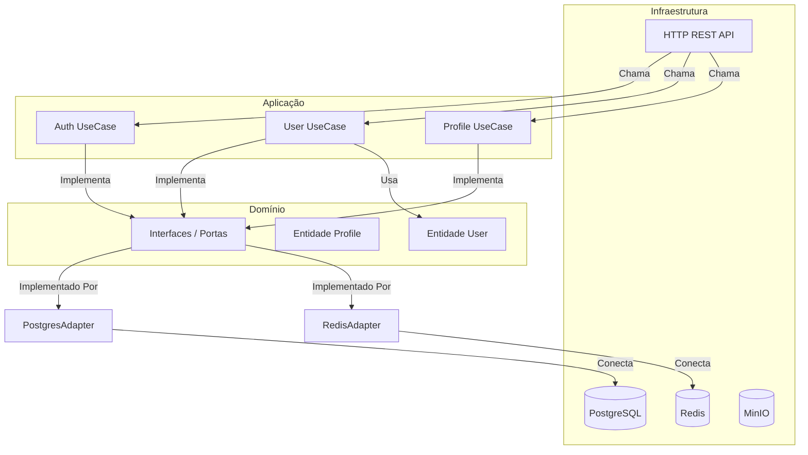
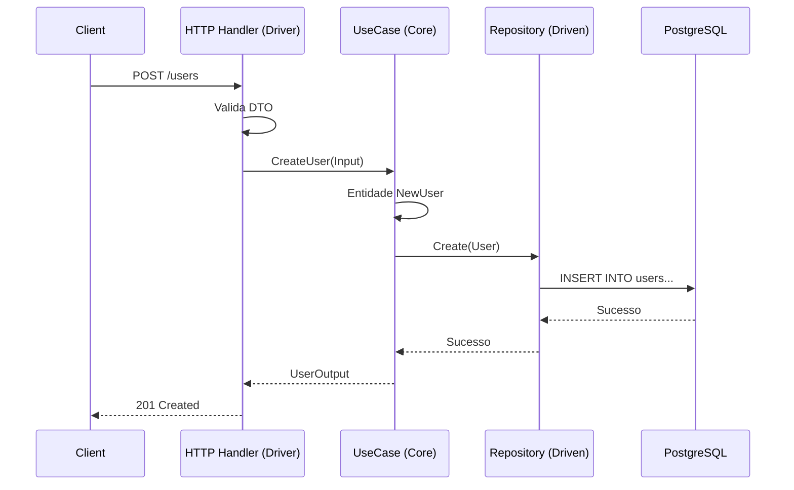
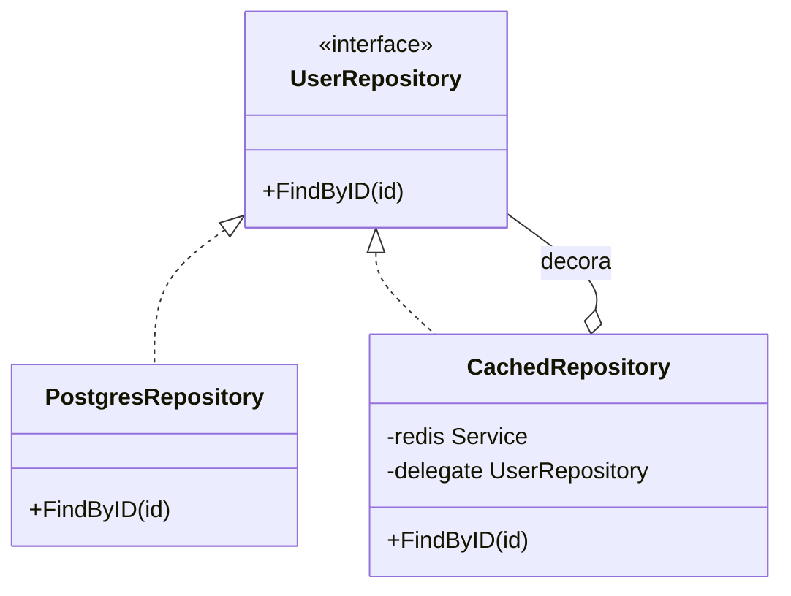

# Arquitetura da Solução

## Visão Geral
Este projeto implementa uma **Arquitetura Hexagonal** (também conhecida como Ports and Adapters). Este padrão arquitetural visa criar componentes de aplicação fracamente acoplados que podem facilmente se conectar ao seu ambiente de software por meio de portas e adaptadores. Isso torna os componentes intercambiáveis em qualquer nível e facilita a automação de testes.

## Arquitetura de Alto Nível

O sistema é projetado com o **Domain** (Domínio) no centro, cercado pela **Application Layer** (Camada de Aplicação - Casos de Uso) e, finalmente, pela **Infrastructure Layer** (Camada de Infraestrutura - Adaptadores).



## Estrutura de Diretórios
A organização do código reflete o conceito arquitetural:

```
internal/
├── core/                   # O Hexágono (Lógica de Negócio)
│   ├── domain/             # Regras de Negócio Corporativas (Entidades)
│   ├── port/               # Interfaces de Entrada e Saída (Input/Output Ports)
│   └── usecase/            # Regras de Negócio da Aplicação
│
├── adapter/                # Adaptadores (Infraestrutura)
│   ├── driver/             # Adaptadores de Condução (Entrada) -> ex: REST API
│   └── driven/             # Adaptadores Conduzidos (Saída) -> ex: Postgres, Redis
│
└── di/                     # Injeção de Dependência
```

## Componentes Principais

### 1. Domain (`internal/core/domain`)
Este é o coração da aplicação. Contém as regras de negócio corporativas e entidades (`User`, `Profile`, `Auth`). Estes objetos não possuem dependências externas.

### 2. Ports (`internal/core/port`)
As portas definem as interfaces para interação.
*   **Input Ports** (Primárias): Definem como o mundo externo se comunica com a aplicação (ex: `UserUseCase`).
*   **Output Ports** (Secundárias): Definem como a aplicação se comunica com recursos externos (ex: `UserRepository`).

### 3. Use Cases (`internal/core/usecase`)
Os casos de uso orquestram o fluxo de dados de e para as entidades. Eles implementam as **Input Ports**. Por exemplo, a lógica de `CreateUser` reside aqui. Ela valida a entrada, interage com as entidades de domínio e chama o repositório (Output Port) para salvar os dados.

### 4. Adapters (`internal/adapter`)
Os adaptadores convertem dados entre o formato mais conveniente para os casos de uso/entidades e o formato conveniente para um agente externo.
*   **Driver (Primário)**: O lado "Condutor". Este projeto usa `internal/adapter/driver/rest` (Fiber) para aceitar requisições HTTP e chamar os Casos de Uso.
*   **Driven (Secundário)**: O lado "Conduzido". Implementa as **Output Ports**.
    *   `persistence/postgres`: Implementação dos repositórios com GORM.
    *   `storage/redis`: Cliente Redis para cache.
    *   `storage/minio`: Implementação de armazenamento de objetos.

## Fluxo de Dados
Uma requisição típica (ex: "Criar Usuário") flui pelo sistema da seguinte forma:



## Padrões de Projeto Utilizados

### Padrão Decorator (Caching)
O cache explícito é implementado usando o padrão Decorator. `CachedUserRepository` envolve o `UserRepository` padrão.



Quando `FindByID` é chamado no `CachedRepository`, ele primeiro verifica o Redis. Se não encontrar, chama o `delegate` (PostgresRepository), armazena o resultado em cache e o retorna.

### Injeção de Dependência
As dependências são explicitamente definidas e injetadas em `internal/di/container.go`. Isso torna a aplicação modular e testável, pois implementações reais podem ser trocadas por mocks durante os testes.
